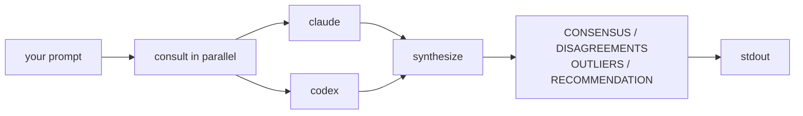

# Senate

```
   ███████╗███████╗███╗   ██╗ █████╗ ████████╗███████╗
   ██╔════╝██╔════╝████╗  ██║██╔══██╗╚══██╔══╝██╔════╝
   ███████╗█████╗  ██╔██╗ ██║███████║   ██║   █████╗
   ╚════██║██╔══╝  ██║╚██╗██║██╔══██║   ██║   ██╔══╝
   ███████║███████╗██║ ╚████║██║  ██║   ██║   ███████╗
   ╚══════╝╚══════╝╚═╝  ╚═══╝╚═╝  ╚═╝   ╚═╝   ╚══════╝
```

A small CLI that asks two or three model CLIs the same question at once (claude and codex by default — both flat-rate; gemini and vibe are opt-in via `-a` since gemini is API-billed per-token and vibe is better as an executor than as an advisor), then writes you a structured opinion — what they agree on, where they disagree, who's the outlier, and a final recommendation. No API keys, no extra bills: it just spawns the CLIs you already have authenticated.

## How I use it

My main agent is Claude Code (Opus). When it hits a real judgment call — "should this migration be one PR or three?", "is this auth model safe?", "are these tests covering the right thing?" — I have it shell out to `senate` for a second opinion. Two or three other models look at the same question, senate folds their answers into one report, and Claude Code reads that as part of deciding what to actually do.

So senate is the **bench seat** for my main agent: cheap to consult, narrowly scoped, structured output, and you can always see which advisor said what.

You don't need an "outer agent" to use it. It works fine as a one-shot CLI, a REPL, or piped into and out of `jq`. The Claude-Code-as-orchestrator flow is just where it earns its keep for me.

## How it works



Default path: parallel consult (claude + codex) → synthesize → print. No orchestrator round-trip, no execution.

Two opt-ins on top:

- `--smart` adds a Claude routing step before the consult phase (the orchestrator decides whether to consult, execute, or both).
- `--execute-only` (or letting the orchestrator pick it) runs the task via vibe instead of asking advisors.
- `-a claude,codex,gemini` adds gemini as a third advisor when you specifically want a per-token model in the mix. `-a claude,codex,vibe` does the same for vibe. Synthesis prefers leads in this order: claude → codex → gemini → vibe.

## Install

```bash
# From npm
npm install -g senate-ai

# Or from source
git clone https://github.com/tofuchick3n/senate
cd senate && npm install && npm run build && npm link
```

Each wrapped CLI (claude / codex / gemini / vibe) authenticates separately — senate doesn't manage their credentials. Verify with:

```bash
senate --check-engines
```

Try it:

```bash
senate "Should I use REST or GraphQL for an internal API?"
```

A few common shapes:

```bash
echo "Compare Rust and Zig for systems work" | senate
senate < spec.md
senate --repl "First question — let's talk about it"
senate --list-sessions && senate --resume 0
```

## Use from a Claude Code agent

This repo ships a Claude Code skill at [`skills/senate/SKILL.md`](skills/senate/SKILL.md) that teaches an orchestrator agent when and how to consult senate (canonical invocation, the path-resolution gotcha, how to read the synthesis output).

Install (or update) it with the bundled command:

```bash
senate --install-skill           # copies the bundled skill to ~/.claude/skills/senate
senate --install-skill --force   # overwrite an existing install (after upgrading senate)
senate --skill-status            # show whether the installed skill matches the bundled one
senate --uninstall-skill         # remove it
```

After that, any Claude Code agent can use it — the skill auto-loads when the agent considers consulting senate (judgment calls, plan critiques, "should I X or Y" decisions). Run `senate --skill-status` after upgrading senate; if it reports `differs`, re-run `senate --install-skill --force` to pick up SKILL.md changes.

> The skill isn't installed automatically on `npm install` — npm postinstall scripts are commonly disabled in CI / corporate environments, so the install is opt-in via the command above.

## Recipes

`senate --help` lists every flag, but it doesn't show how to compose with other tools. The patterns I actually use:

> **Heads-up on file paths.** When you reference a file path *inside the prompt string*, use an absolute path. Each advisor CLI spawns as a child process and may not resolve relative paths the way your shell does. The cleanest workaround is what most recipes below do: **pipe content via stdin** instead of asking the advisors to read files themselves.

### Review a GitHub issue

```bash
# Issue body only
gh issue view 703 --repo OWNER/REPO --json title,body \
  --jq '"# \(.title)\n\n\(.body)"' \
  | senate "Review this issue and recommend next steps:"

# Body + comments (full thread)
gh issue view 703 --repo OWNER/REPO --json title,body,comments \
  --jq '"# \(.title)\n\n\(.body)\n\n## Comments\n" + ([.comments[] | "**\(.author.login):**\n\(.body)"] | join("\n\n"))' \
  | senate "Help me decide what to do here:"
```

### Issue plus the linked source

```bash
{ gh issue view 703 --json body --jq .body
  echo "---"
  cat src/relevant/file.ts
} | senate --consult-only "Review this in light of the existing code:"
```

### Critique an implementation plan against its issue

For "I have an issue and a written plan — does the plan actually solve the issue?":

```bash
{ gh issue view 452 --repo OWNER/REPO --json title,body \
    --jq '"# ISSUE\n\n# \(.title)\n\n\(.body)"'
  echo
  echo "# IMPLEMENTATION PLAN"
  echo
  cat plans/issue-452-the-plan.md
} | senate --consult-only --no-tui --quiet --timeout 10m \
    "Critique the plan against the issue. Cover tradeoffs, retry/dedup, observability, failure modes."
```

`--no-tui --quiet` makes stdout the synthesis only — clean for piping into a file, `pbcopy`, or `jq`.

### Pipe a PR diff

```bash
gh pr diff 42 | senate "Review for bugs, naming, and edge cases:"
```

### Review your unstaged changes (`--diff`)

```bash
senate --diff                              # `git diff` of unstaged changes, default review prompt
senate --diff "focus on the auth changes"  # same diff, narrower focus
senate --diff path/to/patch.diff           # review a saved diff file
gh pr diff 42 > /tmp/p.diff && senate --diff /tmp/p.diff "is this safe to merge?"
```

`--diff` packs the diff into the prompt with a sensible review framing, so you skip the `cat ... | senate "review this:"` pattern.

### Just the recommendation, machine-readable

```bash
gh issue view 703 --json body --jq .body \
  | senate "Architecture review:" --json \
  | jq -r .synthesis.structured.recommendation
```

### Get just the disagreements

```bash
senate "..." --json | jq '.synthesis.structured.disagreements'
```

### Iterate on a long doc

```bash
senate --repl < spec.md
# senate> what are the riskiest assumptions?
# senate> draft a migration plan for the database schema
# senate> /history
# senate> /exit
```

### Skip vibe for read-only review work (faster)

```bash
senate -a claude,codex "Compare REST vs GraphQL for an internal API"
```

## Modes

| You want | Use |
|----------|-----|
| Default — consult + synthesize, no execute | _(no flag)_ |
| Let Claude decide whether to consult and/or execute | `--smart` |
| Skip the synthesis step | `--no-synthesis` |
| Pick advisors | `-a claude,codex` |
| Just run vibe | `--execute-only` |
| Drop into a REPL after the first answer | `--repl` |
| Machine output | `--json` or `--json-stream` |
| Don't save this session | `--no-transcript` |
| Hide the live dashboard | `--no-tui` |
| Final result only (no progress chatter) | `--quiet` |

For the full set, run `senate --help`. The reference table is at the bottom.

## Conversation REPL

`senate --repl "..."` runs the first turn normally, then drops into a `senate>` prompt. Each follow-up turn prepends prior turns as context (using the synthesis recommendation when available, falling back to prose, then raw advisor outputs).

```
senate> /history
senate> /clear
senate> /exit
```

Ctrl-C cancels the current turn (partial result saved); a second Ctrl-C exits. Each turn becomes its own session file under `~/.senate/sessions/`.

The REPL is skipped automatically in machine modes, when stdin is piped (one-shot input), and after a cancelled run.

## Persistent transcripts

Every senate run writes a JSONL transcript to `~/.senate/sessions/<utc>-<seq>.jsonl` unless `--no-transcript`. Each file holds: a `session_start` line with the prompt and mode, every `WorkflowEvent` as it happens, and a `session_end` line with the full `WorkflowResult`.

```bash
senate --list-sessions          # 20 most recent
senate --list-sessions 5        # most recent 5
senate --resume 0               # reprint newest
senate --resume <path>          # reprint a specific file
```

Writes are best-effort — IO failures never block the run, just print one warning to stderr.

## Cost & timing

The human-mode footer shows per-engine wall-clock, tokens, and cost where available:

```
────────────────────────────────────────────────────────────
  USAGE
────────────────────────────────────────────────────────────
  claude                  4.8s  12 tok (6 in / 6 out)  $0.1233
  gemini                  4.6s  12016 tok (3530 in / 27 out)
  synthesis (claude)      4.9s
  ──────────────────── ───────
  total                   9.6s
```

Tokens come from each engine's JSON output mode (claude and gemini). Vibe stays on text mode and doesn't surface tokens — only its wall-clock shows up. The same data is on `EngineResult.usage` for `--json` consumers.

## Live dashboard

In a real terminal (stderr is a TTY) and human mode, you get an animated per-advisor panel — spinner, ticking elapsed, status glyph. It renders to stderr so stdout stays clean for piping. Auto-disables when:

- `--json` or `--json-stream` is set
- stderr isn't a TTY (output is being piped)
- you pass `--no-tui`

When disabled you get the static fallback: banner + per-engine settle line as each advisor finishes.

## Engines

Four wrapped CLIs. Each must be installed and authenticated independently:

| Engine | Install / auth | Default advisor? |
|--------|----------------|-----------------|
| claude | Install per Anthropic docs; run `claude` to authenticate | ✅ |
| codex | `npm install -g @openai/codex` then `codex login` (uses your ChatGPT Plus session) | ✅ |
| gemini | Set `GEMINI_API_KEY` env var, or have Code Assist eligibility | ⛔ opt-in (API-billed per token) |
| vibe | Run `vibe --setup` | ⛔ executor, not advisor |

Verify with `senate --check-engines`. Override binary paths with `SENATE_CLAUDE_BIN=/opt/homebrew/bin/claude senate "..."` (same for `_CODEX_BIN`, `_GEMINI_BIN`, `_VIBE_BIN`). Adding a new engine is one entry in `src/registry.ts` — see `docs/engines.md`.

**Default-advisor policy.** Claude and codex are flat-rate (Claude Code subscription / ChatGPT Plus), so they don't surprise you with a bill mid-month. Gemini is per-token API-billed and was previously on by default — flipped to opt-in in v0.4.7 after a real-world incident where it silently degraded to claude-only when an account hit its monthly spending cap. Re-enable explicitly with `-a claude,codex,gemini` or via `~/.senate/config.json`.

**Optional `SENATE_VIBE_WRAPPER` for richer vibe handling.** If you've installed a vibe-orchestration wrapper script (e.g. the one from [pcx-wave/vibe-skill](https://github.com/pcx-wave/vibe-skill) at `~/tools/vibe-delegate`), senate auto-detects it and spawns the wrapper instead of bare `vibe`. The wrapper handles shell-safe prompts, streaming supervision, and an audit log at `~/.local/share/delegate-runs.jsonl`. Override with `SENATE_VIBE_WRAPPER=/path/to/wrapper senate "..."` or fall back to `~/tools/vibe-delegate` if present. When neither exists, senate calls `vibe` directly — no behavior change for users who haven't installed a wrapper. Either way, senate now reads real per-call token counts from vibe's session log (`~/.vibe/logs/session/<id>/meta.json`) and surfaces them in the USAGE footer. *Note: Mistral Pro is a flat-rate plan, so senate does NOT report a `costUsd` for vibe — only tokens. The same applies to codex on ChatGPT Plus.*

**Model selection.** Senate pins gemini to `gemini-3-flash-preview` and lets codex auto-route based on your auth surface (ChatGPT Plus picks based on subscription tier; passing `-m gpt-5-codex` on a ChatGPT-account session returns a 400). Override per call with `SENATE_GEMINI_MODEL=gemini-3.1-pro-preview senate "..."` (pair with `--timeout 10m` for Gemini Pro) or `SENATE_CODEX_MODEL=o3-mini senate "..."` (codex API auth only).

## Config file

`senate` reads `~/.senate/config.json` at startup. Currently one field is honored:

```json
{ "advisors": ["claude", "vibe", "gemini"] }
```

When the config file defines `advisors`, it becomes the default for `-a` so you don't have to retype the list. Pass `-a` on the CLI to override per-run. If no config file exists, the registry default (`claude,codex`) is used.

## Cancellation (Ctrl-C)

First Ctrl-C cancels in-flight engines (SIGTERM, then SIGKILL after 1s grace; kills the whole subprocess group), prints whatever finished, exits 130. Second Ctrl-C: immediate exit.

## JSON output

`--json` prints the full `WorkflowResult` as one JSON blob on stdout:

```ts
{ decision, advisorResults, synthesis, executionResult, totalDurationMs, cancelled }
```

`--json-stream` prints NDJSON events on stdout as the workflow progresses: `orchestrator_done`, `consult_start`, `engine_done`, `consult_done`, `synthesis_start`, `synthesis_done`, `execute_start`, `execute_done`, plus a final `{type:'result', result:...}`. Errors come through as `{type:'error', message:'...'}`.

The synthesis structured object:

```ts
{
  consensus: string[],
  disagreements: [{ topic: string, positions: [{ engine: string, stance: string }] }],
  outliers: [{ engine: string, note: string }],
  recommendation: string
}
```

Available on `WorkflowResult.synthesis.structured`. The human view is rendered deterministically from this. If the model returns malformed JSON, the prose falls back to the raw output and `structured` is `null`.

## All flags

| Flag | What it does |
|------|--------------|
| `[query]` | Positional. Optional if stdin is piped |
| `--consult-only` | Only consult advisors. Implies execute=false. Bypasses orchestrator |
| `--execute-only` | Only execute via vibe. Implies consult=false. Bypasses orchestrator |
| `--no-consult` | Skip consult phase |
| `--no-execute` | Skip execute phase |
| `--smart` | Opt into orchestrator routing (Claude decides what to do) |
| `--diff [file]` | Review a diff. No arg → `git diff` (unstaged); with a file path → that file. Optional positional query becomes the review focus |
| `-a, --advisors <list>` | Comma-separated advisor names. Default: `claude,codex` |
| `--timeout <duration>` | Per-advisor inactivity timeout. Accepts `600`, `600s`, `10m`, `1h`, `1500ms`. Defaults: claude=240s, codex=240s, gemini=240s, vibe=60s |
| `--no-synthesis` | Skip synthesis |
| `--json` | Print final `WorkflowResult` as JSON to stdout |
| `--json-stream` | NDJSON events on stdout. Mutex with `--json` |
| `--no-tui` | Disable the live dashboard |
| `--quiet` | Suppress banner, dashboard, settle lines, save footer — final result only (good for scripts) |
| `--repl` | Drop into a `senate>` REPL after the first result |
| `--no-transcript` | Don't persist this session |
| `--list-sessions [count]` | List recent saved sessions (default 20) |
| `--resume <ref>` | Reprint a saved session by index (0=newest) or path |
| `--list-engines` | List configured engines + resolved bin paths |
| `--check-engines` | Ping each engine to verify auth |
| `--install-skill` | Copy the bundled Claude Code skill to `~/.claude/skills/senate` |
| `--uninstall-skill` | Remove the skill from `~/.claude/skills/senate` |
| `--skill-status` | Show whether the installed skill is in sync with the bundled one |
| `--force` | With `--install-skill`, overwrite an existing install |
| `-v, --verbose` | Show mode/advisors at startup |

## Scripts

| Script | What |
|--------|------|
| `npm run build` | tsc to dist/ |
| `npm test` | Runs node:test on compiled dist/__tests__ |
| `npm run typecheck` | `tsc --noEmit` |
| `npm run dev -- "..."` | tsx watch mode |

For internals, see [`docs/architecture.md`](docs/architecture.md), [`docs/engines.md`](docs/engines.md), [`docs/usage.md`](docs/usage.md), and [`docs/roadmap.md`](docs/roadmap.md).

## Author

Built by **Deian Isac** — [deianisac.com](https://deianisac.com/) ([@tofuchick3n](https://github.com/tofuchick3n) on GitHub).

Issues, ideas, and PRs welcome at [github.com/tofuchick3n/senate](https://github.com/tofuchick3n/senate).

## License

MIT
