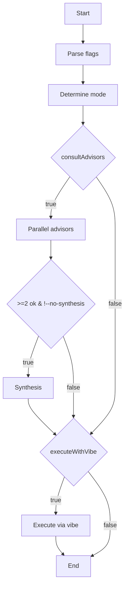

# Architecture

## Overview
Senate is a multi-model orchestration CLI built with Node 18+, TypeScript ESM, and commander. It wraps the local `claude`, `vibe`, and `gemini` CLIs without managing API keys; each underlying CLI handles its own authentication. The tool coordinates parallel advisor consultation, synthesis of results, and optional execution via the vibe CLI. Default advisors are claude and vibe.

## High-level flow



## Module map

**src/cli.ts** owns commander setup, flag parsing (`--consult-only`, `--execute-only`, `--no-consult`, `--no-execute`, `-a/--advisors`, `--no-synthesis`, `--list-engines`, `--check-engines`, `-v/--verbose`), and mode determination logic. Flag combinations like `--consult-only` force `execute=false`; `--execute-only` forces `consult=false`. Any explicit mode flag skips the orchestrator round-trip.

**src/workflow.ts** owns `runWorkflow` and `formatWorkflowResult`. It orchestrates the parallel advisor phase via `Promise.allSettled`, prints per-engine settle lines as they complete, and triggers synthesis when at least two advisors return `status='ok'` and `--no-synthesis` is not set. Vibe execution is a separate later step only when `decision.executeWithVibe` is true.

**src/orchestrator.ts** owns the Claude routing decision that determines the `Decision` object. It exports `extractJson()` which strips Markdown code fences before `JSON.parse()` and falls back to defaults on parse failure.

**src/engines.ts** owns the spawn-based engine runner for all supported CLIs. It implements an inactivity timer (configurable, default 30s) and a 5-minute hard cap per engine. It also contains auth-error pattern detection logic that inspects stderr output.

**src/synthesis.ts** owns the lead summarizer with a claude→vibe→gemini fallback chain. It uses a structured prompt with `CONSENSUS`, `DISAGREEMENTS`, `OUTLIERS`, and `RECOMMENDATION` sections. Only advisors that actually responded are named in the synthesis prompt.

## Core types

```typescript
type Decision = {
  consultAdvisors: boolean;
  advisors: string[];
  executeWithVibe: boolean;
  explanation: string;
};

type EngineResult = {
  name: string;
  status: 'ok' | 'error' | 'missing' | 'unauthenticated';
  output: string;
  durationMs: number;
  error?: string;
};

type SynthesisResult = {
  engine: string;
  output: string;
  durationMs: number;
};

type WorkflowResult = {
  decision: Decision;
  advisorResults: EngineResult[];
  synthesis: SynthesisResult | null;
  executionResult: EngineResult | null;
  totalDurationMs: number;
};
```

## Parallel advisor pattern

Advisors run in parallel via `Promise.allSettled` with `stream=false` to avoid interleaved stdout. Each engine's result prints a settle line as it completes: `✓ name — ok (ms) [waiting: …]`. Streaming is disabled during the parallel phase because concurrent write operations to the same stdout buffer would garble output, making it impossible to attribute responses to specific engines. `allSettled` ensures all advisors are attempted regardless of individual failures.

## Synthesis & lead fallback

Synthesis runs automatically when at least two advisors return `status='ok'` and `--no-synthesis` is not set. The lead summarizer attempts engines in order: claude → vibe → gemini. Fallback exists because any engine may be missing, unauthenticated, or fail during execution; the chain ensures synthesis proceeds with the first available working engine.

## Error & auth detection

`EngineResult.status` is an enum of `'ok'`, `'error'`, `'missing'`, or `'unauthenticated'`. Auth detection uses case-insensitive substring matching on stderr against patterns: `not logged in`, `please run /login`, `api key not set`, `authentication failed`, `must specify the gemini_api_key`. A non-zero exit code combined with a matching auth pattern yields `status='unauthenticated'`. Stderr containing `ENOENT` or `not found` yields `status='missing'`.

## Adding a new engine

Add an entry to `ENGINE_CONFIGS` in `src/engines.ts` with the `bin` name, argument template, and parse function. Ensure the auth-error pattern list covers the new CLI's error strings. Optionally add the engine name to the default advisor list in `src/cli.ts` so it participates in parallel consultation by default.
