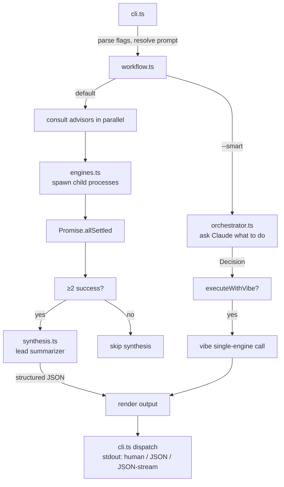

# Architecture

Senate is a Node 18+ TypeScript ESM CLI built with commander. It spawns local CLIs (`claude`, `vibe`, `gemini`) as child processes, consults them in parallel, synthesizes their answers, and renders the result. No API keys are handled by senate itself.



## High-level flow

1. `cli.ts` parses flags, resolves the prompt (positional + stdin)
2. `workflow.ts` decides the path:
   - If `--smart`: `orchestrator.ts` asks Claude what to do
   - Otherwise: defaults (consult all selected advisors, synthesize, no execute)
3. Advisors run in parallel via `Promise.allSettled` (`engines.ts` spawns each child detached so the whole subprocess group can be killed)
4. If ≥2 succeed and synthesis isn't disabled, `synthesis.ts` asks the lead summarizer (claude → vibe → gemini fallback) for structured JSON: consensus / disagreements / outliers / recommendation. Falls back to raw output if JSON parse fails.
5. If `decision.executeWithVibe`, vibe runs as a separate single-engine call
6. `cli.ts` dispatches the rendered result to stdout: human format, `--json` blob, or `--json-stream` final `{type:'result',...}` line

## Modules

| File | Owns |
|---|---|
| `src/cli.ts` | Commander entry, flag parsing, mode determination, output dispatch (human/JSON/JSON-stream), TUI activation, transcript wiring, REPL invocation, SIGINT handling |
| `src/workflow.ts` | `runWorkflow`, `WorkflowResult`, `WorkflowEvent`, `formatWorkflowResult`. Orchestrates the four phases and emits events |
| `src/orchestrator.ts` | Claude routing call (only used with `--smart`); `extractJson` for parse |
| `src/engines.ts` | `runEngine` — spawn + auth detection + cancellation + usage parsing wiring; `checkEngines`; `RunEngineOptions` |
| `src/synthesis.ts` | Lead-summarizer fallback chain, structured JSON parsing, prose rendering, `synthesize`, `parseStructured`, `extractJson`, `renderSynthesis` |
| `src/registry.ts` | Single source of truth for engine config: bin/args/parse/parseUsage/authPatterns/synthesis-priority/default-advisors/healthCheckTimeoutMs/env. `SENATE_<NAME>_BIN` env override resolution. Helpers: `getEngineConfig`, `listEngineNames`, `listEngineEntries`, `getDefaultAdvisors`, `getSynthesisPriority`, `getAuthPatterns` |
| `src/transcripts.ts` | `TranscriptWriter` (streaming JSONL), `loadSession`, `listSessions`, `resolveSessionRef`. Default dir `~/.senate/sessions/`. Best-effort writes |
| `src/tui.ts` | Live dashboard via `createLogUpdate` — per-advisor row with spinner + ticking elapsed + status glyph. Subscribes to WorkflowEvents through the `onEvent` plumbing. Auto-disables in non-TTY |
| `src/repl.ts` | `buildEnrichedPrompt`, `startRepl`. Drops into a `senate>` prompt after first result; carries prior turns as compressed context |
| `src/ui.ts` | Banner, spinner (used in static fallback path), section helpers |
| `src/__tests__/` | node:test unit tests for registry, synthesis, transcripts, usage parsers, REPL prompt builder |

## Core types

```ts
type Decision = {
  consultAdvisors: boolean;
  advisors: string[];
  executeWithVibe: boolean;
  explanation: string;
};

type EngineUsage = {
  inputTokens?: number;
  outputTokens?: number;
  totalTokens?: number;
  costUsd?: number;
};

type EngineResult = {
  name: string;
  status: 'ok' | 'error' | 'missing' | 'unauthenticated' | 'cancelled';
  output: string;
  durationMs: number;
  error?: string;
  usage?: EngineUsage;
};

type SynthesisStructured = {
  consensus: string[];
  disagreements: { topic: string; positions: { engine: string; stance: string }[] }[];
  outliers: { engine: string; note: string }[];
  recommendation: string;
};

type SynthesisResult = {
  engine: string;
  output: string;
  structured: SynthesisStructured | null;
  durationMs: number;
};

type WorkflowResult = {
  decision: Decision;
  advisorResults: EngineResult[];
  synthesis: SynthesisResult | null;
  executionResult: EngineResult | null;
  totalDurationMs: number;
  cancelled: boolean;
};
```

## Event stream

The workflow emits `WorkflowEvent` types via the optional `onEvent` callback in `RunOptions`:
`mode | orchestrator_start | orchestrator_done | consult_start | engine_done | consult_done | synthesis_start | synthesis_done | execute_start | execute_done`.

Three subscribers wire into this same stream from cli.ts:
- The TUI updates its dashboard
- The transcript writer appends each event to JSONL
- `--json-stream` emits each event to stdout as NDJSON

## Parallel advisor pattern

Advisors run via `Promise.allSettled`. stdout streaming is disabled during the parallel phase (interleaved output is unreadable); each engine's settle is reported as a single line (in static fallback) or as a row update (in TUI). Per-engine inactivity timeouts (default 30s) are independent.

## Synthesis & lead fallback

`synthesize()` builds a structured-JSON prompt naming only the advisors that actually responded. Tries leads in `getSynthesisPriority()` order (default: claude → vibe → gemini), passing through `--smart`'s preferred lead if specified. First successful response wins; if all fail, returns null and the workflow continues with `synthesis: null`.

JSON parse uses `extractJson` (handles fenced / wrapped output) followed by `parseStructured` (coerces partial / malformed shapes into safe defaults). Prose `output` is rendered deterministically from `structured` via `renderSynthesis`.

## Cancellation

`runEngine` accepts `signal?: AbortSignal`. When aborted: SIGTERM the process group (spawn used `detached: true`), then SIGKILL after 1s grace. Returns `status: 'cancelled'`. Workflow short-circuits subsequent phases when `signal.aborted` becomes true between phases. cli.ts traps SIGINT: first press aborts the controller; second exits 130.

## Auth & error detection

Per-engine `authPatterns` list (registry-driven, no global list). Combined stdout+stderr lowercased and substring-matched. Distinct from `'missing'` (ENOENT / "not found") and timeout (inactivity / hard cap). Spawn errors are routed into stderr via a `child.on('error', ...)` listener so missing-binary detection works without uncaught exceptions.

## Adding a new engine

Append one entry to `REGISTRY` in `src/registry.ts`. The CLI default-advisors string, synthesis priority, auth detection, `--list-engines` listing, and `SENATE_*_BIN` resolution all flow from that entry. See `docs/engines.md` for the example.
